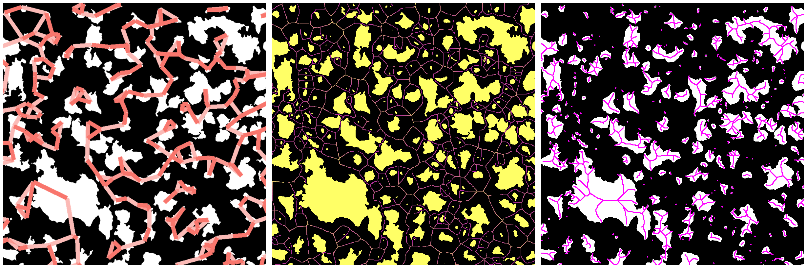

# CerMicroFX

Welcome to **CerMicroFX**: **Cer**amic-matrix-composite **Micro**structure **F**eature e**X**traction. 

All parts of this project were written for a specific dataset of Li4Ti5O12 - nickel anode composites that I studied for my Ph.D. dissertation on multifunctional all-solid-state lithium-ion batteries.

The abstract and full text of my dissertation are available from [this link](http://rave.ohiolink.edu/etdc/view?acc_num=case1619531582582196). The actual text will be realeased in May 2022, as we are currently working on publishing the results in academic journals. 

# Setup

`. . . the possibility of successfully navigating an asteroid field is approximately 3,720 to 1 - C-3PO`

First, clone this bitbucket repo to set up your own local working copy.

You will need to download the raw Scanning Electron Microscopy (SEM) Images, and unzip them into the root folder.
You should get two folders, WHX_05k_HC and WHX_10k_HC. These contain the SEM's taken at 5k and 10k magnification, respectively.

You will then need to download [FIJI Image-J](https://imagej.net/software/fiji/) if you have not already.

You must edit the FIJI.Rmd file to show it where you installed FIJI.
You can then run the FIJI.Rmd file to automatically run the Image-J macros. Do this only once.
This will save the appropriate data to the data-files folder.

You can then run the imports files, master file, and plot generation Rmd files. See Contents below for details.

# Contents Overview

This project has multiple sections.

* Import Rmd Files

These Rmd files take the data generated from ImageJ and modify or create new data files, usually saved as csv files in the data-files folder for quick import in the master file.

* Master File

This is the file you will run the most. It imports the data saved from the import Rmd files, modifies the data for use in the plot generation files.

* Plot Generation Rmd Files

These Rmd files take the modified data that was imported in the master file, and make nice plots.

For example, the Coarsening-Plots.Rmd file contains plots that pertain to coarsening analysis.
These files can generally be run in any order with one exception.
**The R3-PCA.Rmd file must be run in order to run the Machine-Learning.Rmd file**

* Export Folders

These folders contain the saved plot exports from specific plot generation files, e.g. Machine-Learning.Rmd exports to MLexports.

* ImageJ - FIJI Macros

These .ijm files run on the raw SEM image files and save the data to data-files folder. The FIJI.rmd file is designed to auto-run all the image j macros to reduce the size of the repo in the future. Right now the repo should be good to go as-cloned, you should not need to run the FIJI.rmd file.

## Contributing

## License
